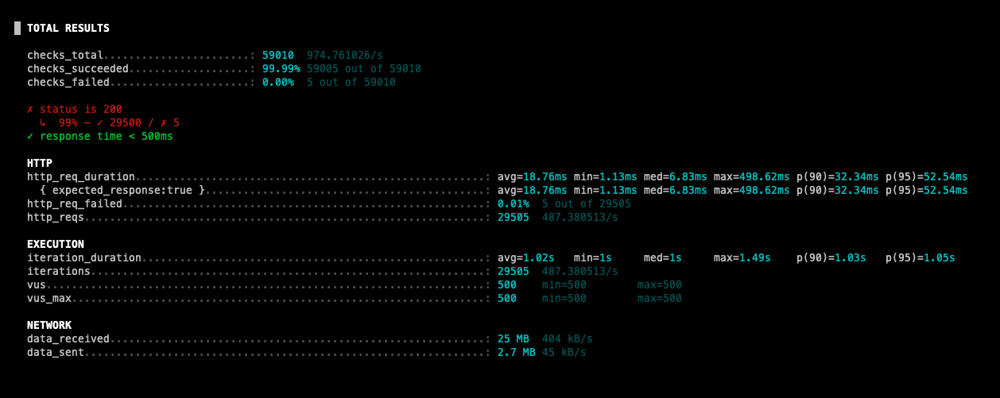
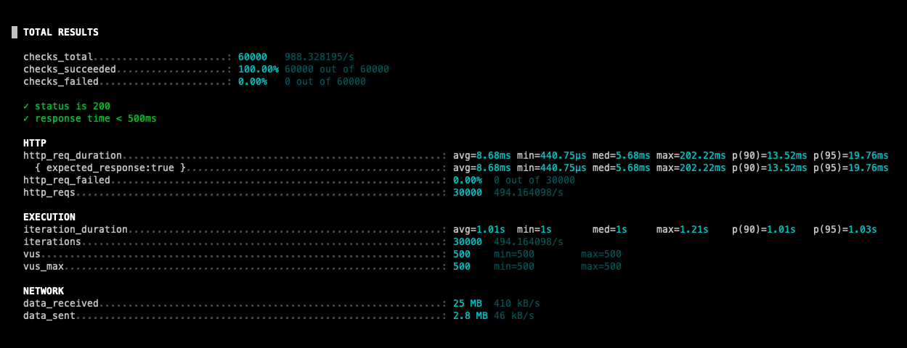
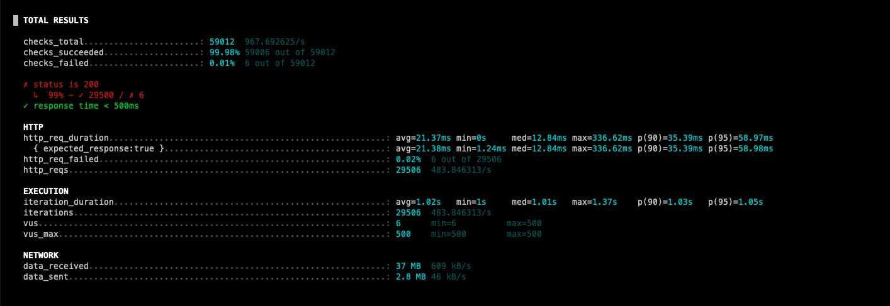
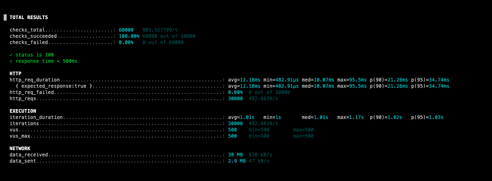
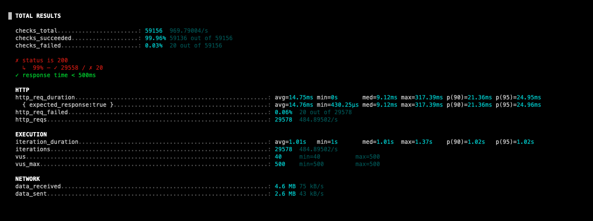
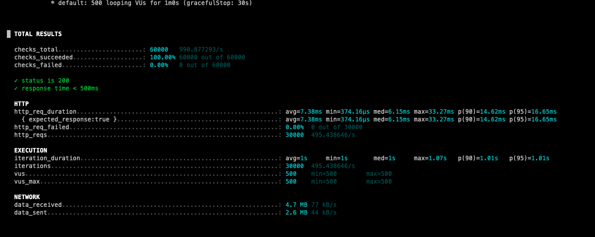

# 콘서트 대기열 애플리케이션 캐싱 적용 보고서

## 1. 개요

콘서트 대기열 애플리케이션에서는 사용자 요청이 집중되는 시점에 조회 성능 저하가 발생할 수 있습니다. 이에 따라, 자주 조회되며 변경이 적은 데이터를 중심으로 **Redis 기반의 캐시 전략**을 도입하여 시스템의 응답 속도를 개선하고, 데이터베이스 부하를 줄이고자 하였습니다.

---

## 2. 캐싱 전략 설명

### 2.1 읽기 전략

- **Cache Aside (Lazy Loading)**  
  캐시에 데이터가 없으면 데이터베이스에서 조회 후 캐시에 저장하는 방식입니다. 대부분의 조회 기능에 이 전략을 사용했습니다.

- **Read Through**
  캐시 계층이 자동으로 데이터를 조회하고, 저장소와의 동기화를 관리하는 방식으로, 현재는 적용하지 않았지만 확장 가능성을 고려하고 있습니다.

### 2.2 쓰기 전략

- **Write Around**  
  변경이 적은 데이터에 대해 데이터베이스에만 쓰고, 캐시는 다음 읽기 요청 시에 갱신되도록 했습니다.

- **Write Through / Write Back** *(도입 계획 없음)*  
  복잡도 증가 및 실시간 일관성 필요성으로 인해 현 단계에서는 사용하지 않았습니다.

---

## 3. 캐시 적용 대상 선정 기준

캐시는 모든 데이터에 적용하기보다 다음 조건에 해당하는 데이터에 한정하여 적용하였습니다:

- 자주 조회되는 데이터
- 변경이 거의 없는 데이터
- 실시간 일치가 필수는 아닌 데이터

### 선정된 대상 기능

| 기능명            | 캐시 적용 이유                                     |
|------------------|---------------------------------------------------|
| 콘서트 조회        | 사용자 접근 빈도가 높고, 데이터 변경이 드물기 때문       |
| 콘서트 날짜 조회   | 변경 가능성이 매우 낮고, 이벤트 기간 동안 고정되는 값     |
| 유저 포인트 조회   | 실시간 일치가 필요하지 않으며, 조회 빈도가 높은 편임       |

---

## 4. 캐시 적용 전후 성능 비교

성능 테스트는 **가상 유저 500명이 1분간 요청**을 보낸 상황을 기준으로 측정하였습니다.

### 4.1 콘서트 조회

| 구분        | 평균 응답 시간 (ms) |
|-------------|---------------------|
| 캐시 미적용 | 18.76               |
| 캐시 적용   | 8.68                |

**→ 약 54.7% 응답 속도 개선 효과**를 확인할 수 있었습니다.  
TTL(Time To Live)을 설정하여 일정 주기 후 자동으로 캐시가 무효화되도록 구성하였습니다.

> **시각 자료:**
> - Before: 
> - After: 

### 4.2 콘서트 날짜 조회 

| 구분        | 평균 응답 시간 (ms) |
|-------------|---------------|
| 캐시 미적용 | 21.37         |
| 캐시 적용   | 12.18         |

**→ 약 43% 응답 속도 개선 효과**를 확인할 수 있었습니다.  
TTL(Time To Live)을 설정하여 일정 주기 후 자동으로 캐시가 무효화되도록 구성하였습니다.

> **시각 자료:**
> - Before: 
> - After: 

### 4.3 유저 포인트 조회

| 구분        | 평균 응답 시간 (ms) |
|-------------|---------------|
| 캐시 미적용 | 14.75         |
| 캐시 적용   | 7.38          |

**→ 약 49.9% 응답 속도 개선 효과**를 확인할 수 있었습니다.  
기본적으로 TTL(Time To Live)을 설정하여 일정 주기 후 자동으로 캐시가 무효화되도록 구성하였고
추가적으로 포인트 충전이나 포인트 사용 등 쓰기가 발생 시 `@CacheEvict`을 이용하여
redis에서 캐시를 삭제하도록 했습니다.

> **시각 자료:**
> - Before: 
> - After: 

---

## 5. 결론

- 캐시 도입을 통해 주요 기능의 **응답 속도를 절반 이상 줄이고**, **DB 부하를 감소**시킬 수 있었습니다.
