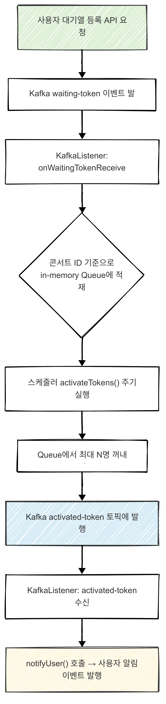
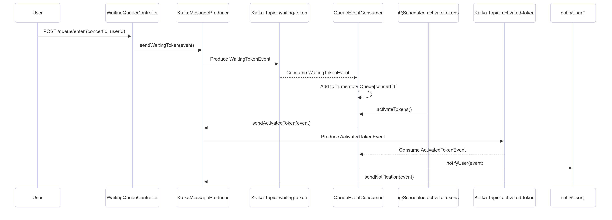

# 대기열 시스템 설계 문서
## 개요
 콘서트 예매 시, 대기열을 kafka 기반으로 구성하여 트래픽 병목 없이 순차적으로 대기열을 처리하도록 설계하고자 했습니다.
 - 주요 기술 : Kafka(3노드)
 - 핵심 구성요소:
   - `WaitingQueueKafkaService`: kafkaProducer 역할
   - `QueueEventConsumer`: kafkaConsumer, 대기열 관리
   - `KafkaMessageProducer`: kafka 메시지 발행
---
## 시스템 흐름 요약
1. 사용자가 대기열에 진입하면 Kafka의 waiting-token 토픽에 WaitingTokenEvent가 전송됨
2. QueueEventConsumer에서 해당 이벤트를 수신하고, 콘서트 ID별로 메모리 큐에 저장
3. 스케줄러가 10초마다 실행되며 콘서트별 최대 3개의 토큰을 activated-token 토픽으로 전송
4. 활성화된 토큰은 다시 Kafka를 통해 수신되며 사용자에게 알림 전송

---
### 대기열 플로우 차트

---

### 대기열 시퀀스 다이어그램

---

## kafka 도커 클러스터 구성
- 브로커 수 : 3(kafka00, kafka01, kafka02)
- 클러스터 타입 : KRaft(kafka 4.0.0 버전부터 기본)
- 외부 접근 포트 : 10000,10001, 10002
- Kafka Web UI: localhost:8085

---
### application.yml의 kafka 설정 요약
- bootstrap-servers: localhost:10000,10001,10002
- producer: JSON 직렬화, 재시도 5회
- consumer: 수동 커밋, 병렬 처리 2개 스레드
- listener: ack-mode(manual) 사용으로 명시적 커밋

---
## 마치며
- Kafka 토픽에 순차적으로 쌓인 메시지를 @KafkaListener가 병렬 또는 순차적으로 소비
- QueueEventConsumer가 큐를 관리하고, 스케줄링하여 토큰 활성화
- 병목 구간을 Kafka 큐 기반 비동기 처리로 해소