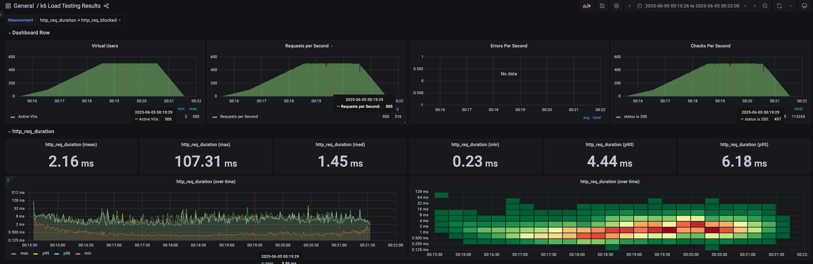
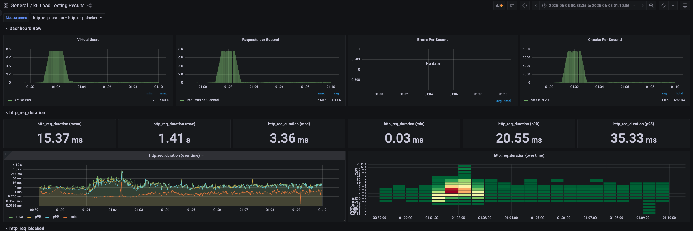
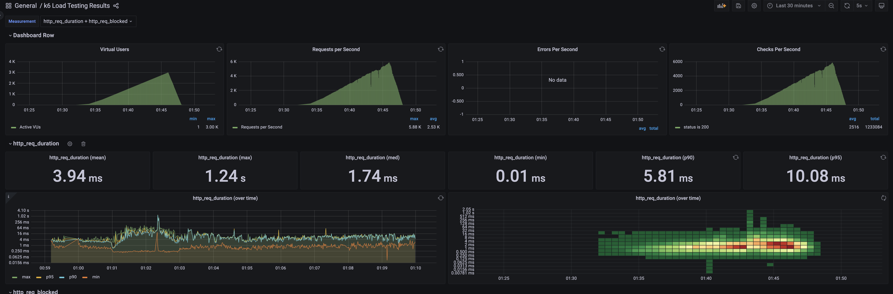

# 콘서트 예약 대기열 API 성능 테스트 보고서
## ✅ 1. 테스트 개요

### 🔹 테스트 대상
- **API**: `POST /queue/entry`
- **기능**: 사용자가 콘서트 예약 대기열에 진입할 수 있도록 Kafka를 통해 대기열 토큰을 발급하는 기능
### 🔹 테스트 목적
- **진입 API의 병목 파악 및 한계치 도출**
### 🔹 서버 스펙
- cpu : 8core
- memory : 24g

---

## ✅ 2. 테스트 시나리오 및 계획

| 테스트 유형            | 목적                              | 목표 TPS                     | 기대 Latency       | 테스트 시간           | 
| ----------------- | ------------------------------- | -------------------------- | ---------------- | ---------------- | 
| 부하 테스트 (Load)     | 일반적인 부하 상황에서 시스템이 정상 작동 가능한지 확인 | 500 TPS                    | < 300ms          | 6분               |
| 피크 테스트 (Spike)    | 갑작스러운 트래픽 증가에 대한 시스템 반응 확인      | 1000 TPS (급등)              | < 500ms          | 2분 스파이크 + 8분 평상시 | 
| 스트레스 테스트 (Stress) | 시스템 한계점을 확인하고 장애 전조 시점을 파악      | 점진적 증가 (500 → 1500 TPS 이상) | Latency 급증 시점 기록 | 10분              | 
| 내구성 테스트 (Soak)    | 장시간 운영 시 시스템의 안정성과 리소스 누수 여부 확인 | 300 TPS 고정                 | 안정된 처리 유지        | 1시간              |

---

## ✅ 3. 테스트 환경

### 🔹 테스트 도구
- **부하 생성 도구**: [k6](https://k6.io/)
- **시각화 및 모니터링**: Grafana + InfluxDB
- **서버 구성**: Spring Boot 기반 API 서버, Kafka Producer 포함

### 🔹 성능 측정 지표
- **Throughput (TPS)**
- **Latency (P95, P99, avg)**
- **Error Rate**
- **VUs**

---

## ✅ 4. 각 테스트 별 결과(grafana 대시보드)
### 1. 부하 테스트

-  요청 수 / 실패 수
    - **전체 요청 수**: 113,746건
    - **실패 요청 수**: 0건
    - **성공률**: 100.00%

-  Latency(처리 시간)

| 지표             | 값          |
| -------------- | ---------- |
| 평균 응답 시간 (avg) | **2.16ms** |
| 중앙값 (median)   | 1.45ms     |
| 최대 응답 시간       | 107.31ms   |
| p90            | 4.43ms     |
| p95            | **6.17ms** |

- 부하 테스트 결과, `/queue/enter` API는 500명의 동시 사용자가 6분간 지속적으로 요청을 보냈음에도 불구하고, 평균 응답 시간 2.16ms, 95% 백분위수 지연 6.17ms로 **매우 빠른 응답 성능을 보였다.** 전체 요청 113,746건 중 단 1건의 실패도 발생하지 않았으며, 이는 **Kafka 기반 메시지 처리 구조가 부하에 대해 안정적인 처리 성능을 가졌음을 시사한다.**

### 2. 피크 테스트
- 총 10분간 테스트를 수행하였고 평상시 vu를 100으로 잡고 30초간 7600까지 급등하고 1분간 유지를 목표로 진행하였다. 급등 이후 vu가 100로 떨어지게 하였다.

- 요청 수 / 실패 수
    - 전체 요청수 : 693,364건
    - 실패 요청 수 : 246건
    - 성공률 : 99.97%
- Latency

| 지표       | 값           |
| -------- | ----------- |
| 평균       | **15.38ms** |
| 중앙       | 3.36ms      |
| 최대 응답 시간 | 1.41s       |
| p90      | 20.58ms     |
| p95      | 35.34ms     |

- 테스트 중 약 7600명의 VU가 동시에 요청을 시도하는 구간에서  `i/o timeout` 오류가 발생하였다. 이는 Docker 기반 테스트 환경에서 `host.docker.internal` 인터페이스가 병목현상을 보이며, 테스트 시점에서 서버의 수신 포트 backlog 초과, 혹은 일시적인 CPU 과부하 등이 원인으로 추정된다.
- 실패율이 높아 임계점을 더 낮게 잡아서 테스트 필요

### 3. 스트레스 테스트

- 요청 수 / 실패 수
    - 전체 요청수 : 1,237,505건
    - 실패 요청 수 : 792건
    - 성공률 : 99.93%
- Latency

| 지표       | 값          |
| -------- | ---------- |
| 평균       | **3.94ms** |
| 중앙       | 1.74ms     |
| 최대 응답 시간 | 1.24s      |
| p90      | 5.81ms     |
| p95      | 10.08ms    |

- 테스트 중 Vus가 2.29k 동시 요청 시도하는 구간에서 `i/o timeout` 오류가 발생하였다. 동시에 influxDB에서도 병목이 발생하였다. 최대 1.24s초가 걸린 지점이다. 서버와 influxDB 둘 다 성능적으로 불안정함을 보이고 있다.

### 4. 내구성 테스트
- vu를 100 잡고 30분간 유지하는 테스트
  
- 요청 수  / 실패 수
    - 전체 요청 수 : 250,238건
    - 실패 요청 수 : 0
    - 성공률 : 100
- Latency

| 평균       | 3.53     |
| -------- | -------- |
| 중앙       | 2.77 ms  |
| 최대 응답 시간 | 113.56ms |
| p90      | 7.36ms   |
| p95      | 8.87ms   |
- 내구성 테스트는 100 VU(동시 사용자)를 기준으로 약 30분간 지속되었으며, 총 **250,238건의 요청이 성공적으로 처리**되었다. 평균 응답 시간은 **3.53ms**, 95%의 요청은 **8.87ms 이하의 응답 시간**을 기록했다. 에러 없이 테스트가 완료되었다.

---
## ✅ 5. 마무리
- 대기열 진입 지점에 대한 부하 테스트를 진행하였습니다. 대기열 발급을 카프카 이벤트로 전환을 하여 테스트를 진행하여서 latency가 굉장히 작은 것을 알 수 있었습니다.
- 테스트 중 발생한 에러
    - i/o timeout
        - 피크 테스트, 스트레스 테스트에서 발생하였으며 이는 요청 수 급증으로 인한 병목 현상
        - -> 임계점을 더 낮게 설정하여 안정성을 유지할 수 있는 임계치 재산정 필요
    - influxDB 푸시 지연(병목) 으로 인해 쓰기 지연 발생
        - k6-> influxDB에 많은 데이터를 빠르게 받지 못하고 지연 발생
        - 측정 데이터 유실로 인해 데이터 수집이 부정확해졌고 신뢰도가 낮아지는 데이터를 만들었다.
        - -> 푸시 주기를 조정하거나 필요한 정보를 제한하는 방식이 필요(tags, fileds)